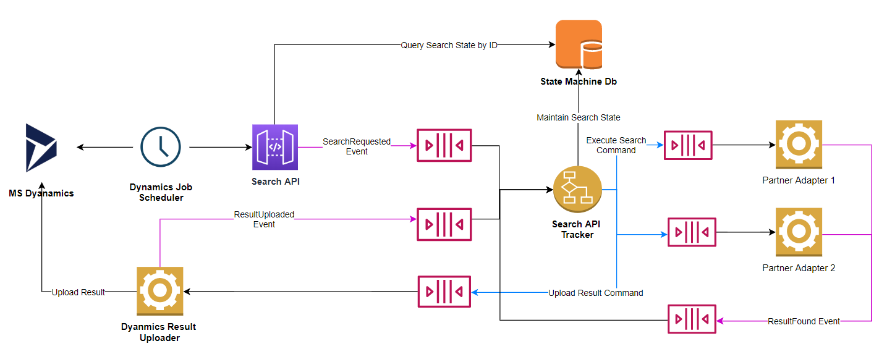

# FAMS3 Integration

The `SearchApi` takes a piece of information from a person and will execute a `search` against data providers.

## Note

- Projects are to be based on .NET Core 3.0
- Message Broker is rabbitMq
- All projects should have a corresponding test project

## Architecture Goal



## Project Structure

    .
    ├── app                     # Application Source Files.
    ├── docs                    # Contains application documentations.
    ├── .gitignore              # Git ignore.
    ├── docker-compose.yml      # Docker Compose definition.
    └── README.md               # This file.

## Run

```bash
docker-compose up
```

Once the containers are up, execute the Entity Frameword migration

```cmd
> dotnet tool install --global dotnet-ef
> cd app/SearchApi.Tracker
> dotnet ef database update
```

Check the health status of the api [here](http://localhost:8081/health)

Download OpenAPi specification [here](http://localhost:8081/swagger/v1/swagger.json)

Access RabbitMq console [here](http://localhost:15672), use default rabbitmq username and password.

Access OmniDb [here](http://localhost:8091), you can configure the tool to point to postgres using the `docker-compose.yml` options.

You can interact with the search api using the following [Postman Collection](docs/BcGovSearchApi.postman_collection.json) and [Postman Environment](docs/BcGovApi.postman_environment.json)

When a POST request is send to the people api, a `searchRequested` event is sent to the tracker.
The traker stores the `investigationState` in the StateMachine Database.

## Projects

### SearchAPI

_This is the API that will be called by the Scheduler Plugin to search for person sought_

### SearchAPI.Test

_This is the test project for the Search API project_

### JobManager

_This is the  Scheduler Plugin_

### JobManager.Test

_This is the test project for the  Scheduler Plugin_

## Libs

### SearchApi.Core

This class lib project encapsulate reusable components accross search api applications.
